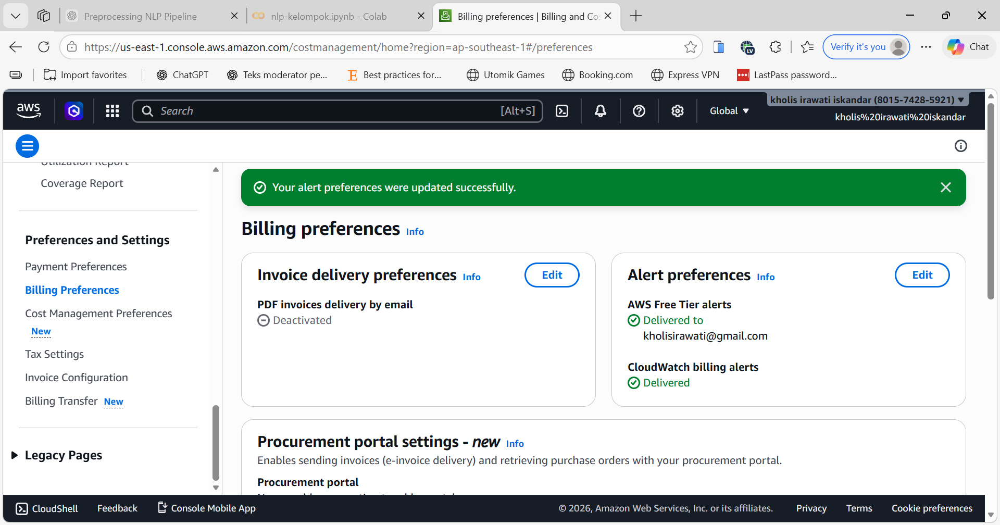
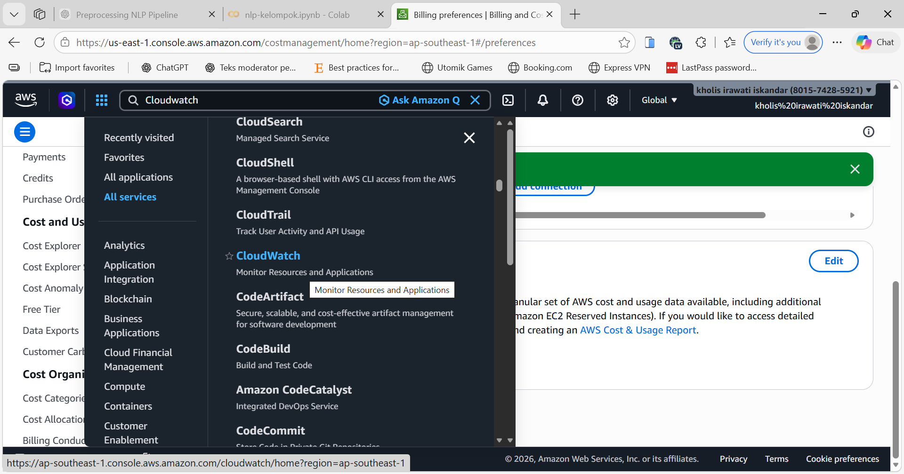
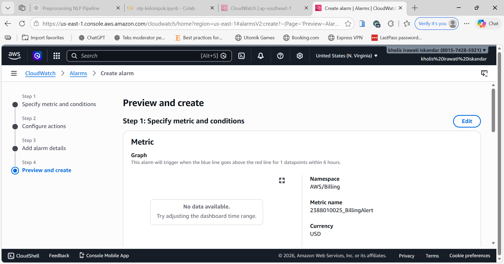
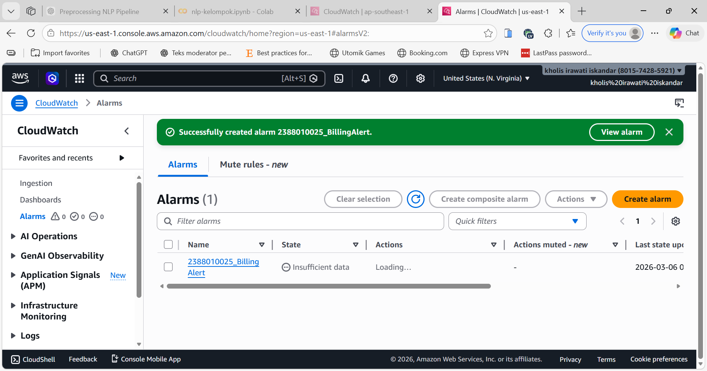

#Membuat Billing Alert di AWS untuk menghindari kelebihan alokasi dana

1. Menu Dashboard AWS kita pilih billing preference untuk   mengaktifkan alert

    - Masuk menu billing and Cost manajemen
    - Pada menu cost manajemen scroll kebawah 
    pilih billing preferences
    - Isi Email ceklis receive
    - Klik Update
    

2. Menu Cloudwatch 
    - All Service pilih Cloudwatch
    

3. Pilih menu createalarm
    - Pastikan Region ada di US N Virginia
    - Klik menu Create Alarm
    - Klik Metric
    - Klik Menu Billing
    - Pilih menu Total Estimated Charge
    - Pilih ceklis Mata uang USD
    - Klik Select Matric
    - Beri nama Alert = NIM_BillingAlert
    - Condition Static -> GreatHearta-> 1 USD
    - Create new Topic => NIM_BillingAlert -> Klik create
    - Klik Next
    - alarm Name -> NIM_BillingAlert
    - Create Alarm
    - Buka Inbox/Spam dari AWS kemudian klik confirm
    
    
    

