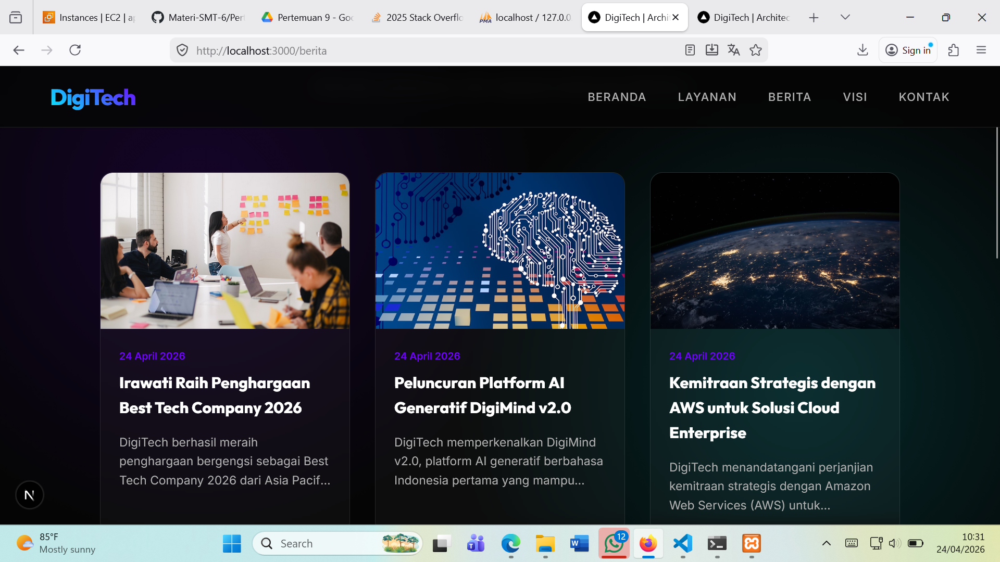

# Deploy Web Apps Framework Next.Js ke AWS

1. Pastikan Web Apps berjalan di local
- install dependensi 'npm install'
- create db dan import sql
- jalankan web apps 'npm run dev'
-  akses web apps di browser 'http://locallhost:3000'
- testing front pastikan tampilan muncul dan tanpa error
- testing backend http://localhost:3000/admin
    username: admin
    pass    : admin123

- Create State File -> npm run build
- Archive folder standalone -> zip -> klik kanan folder
standalone -> send to -> compressed (zipped) folder

