1. Membuat Instance

2. Membuat Folder Project
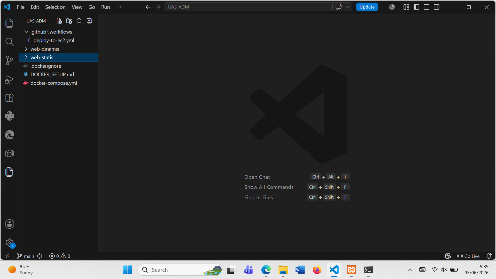

3. Pindahlan project web static UTS ke dalam folder project stati-web
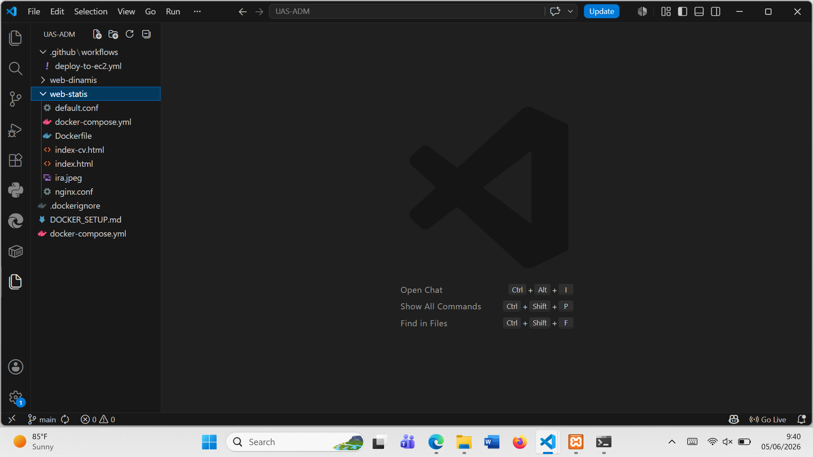

4. Membuat dashboard.php
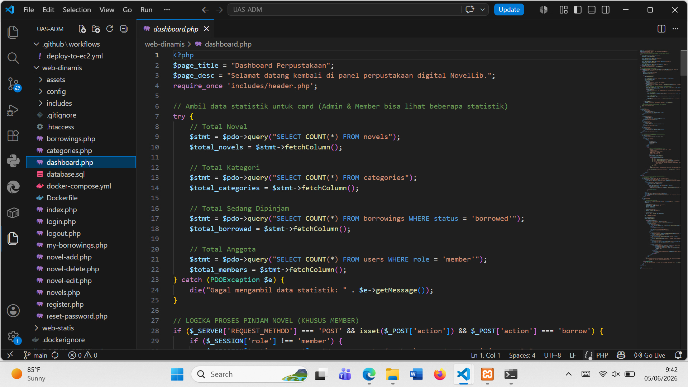

5.Tahap Verifikasi Instalasi dan Pengujian Environment Docker
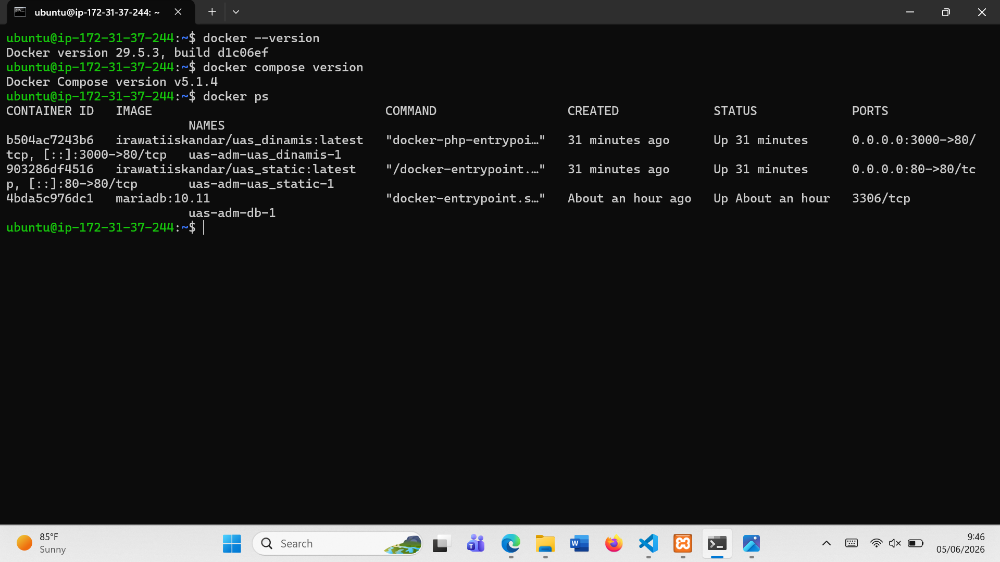

6. Pembuatan dan Publikasi Docker Image (Build & Push to Docker Hub)

7. Membuat repository docker

personal acsess token
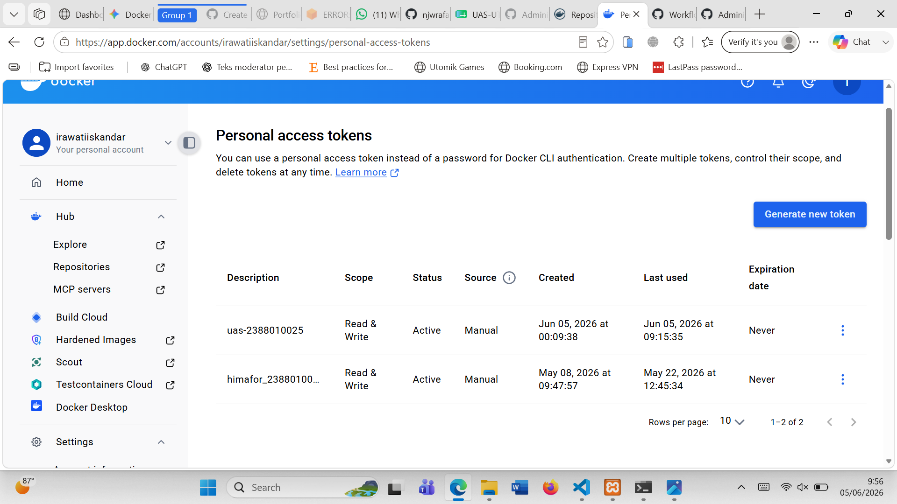
sudah terhubung
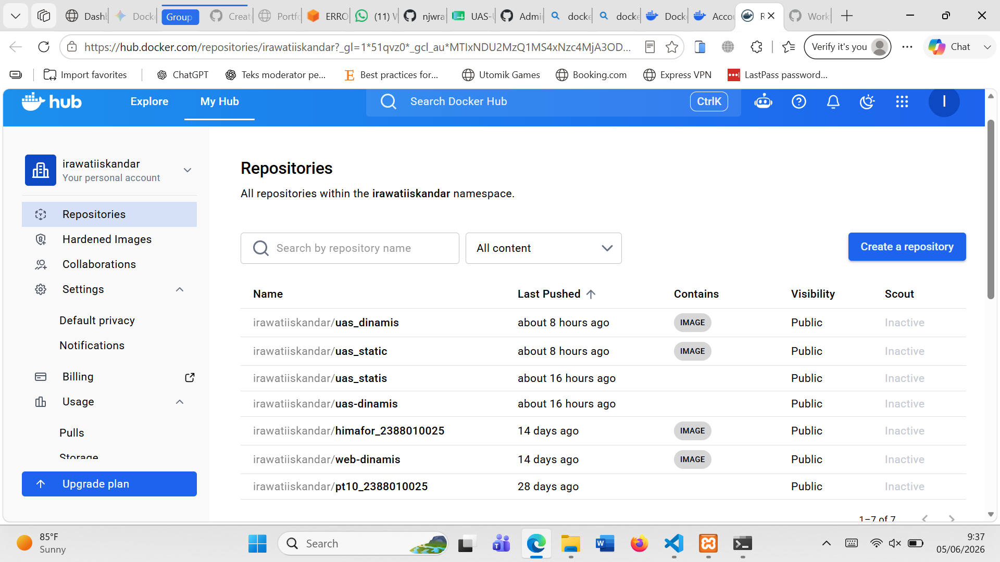

8. Set Up Github repository & Github Secret
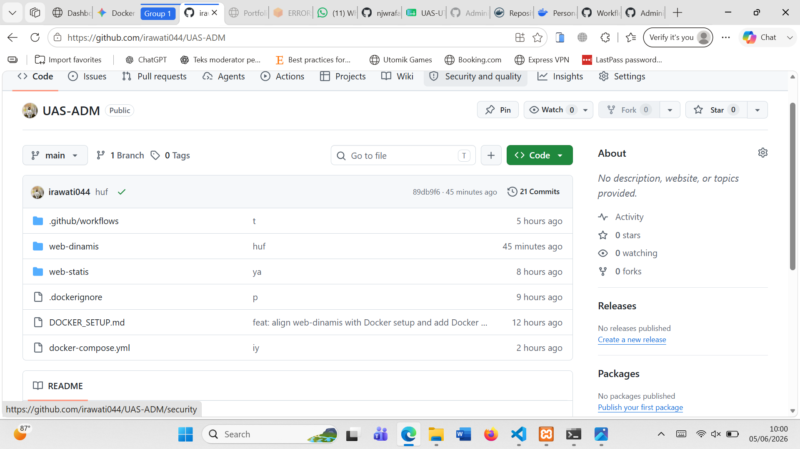
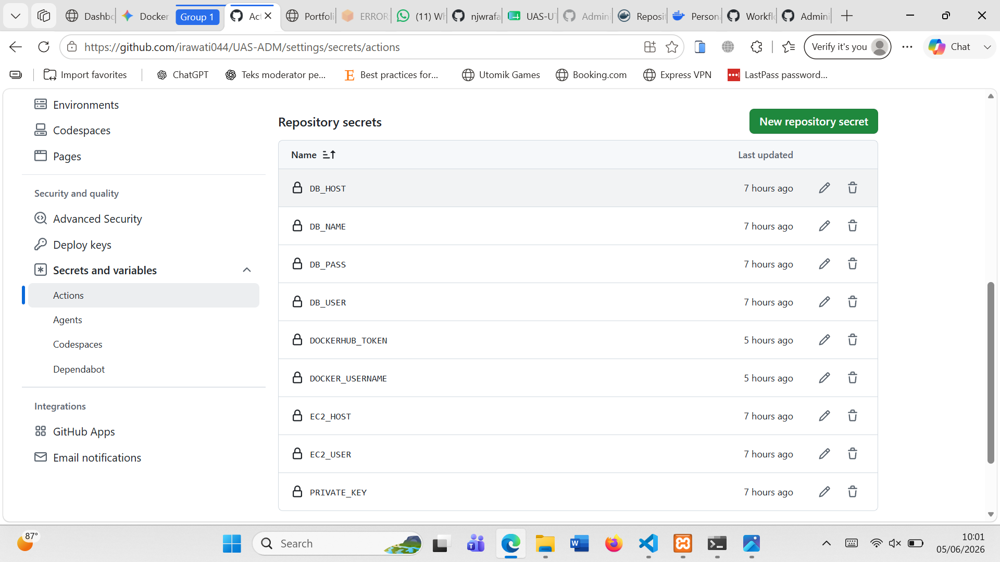

4. commit ke github

  terbaru 
  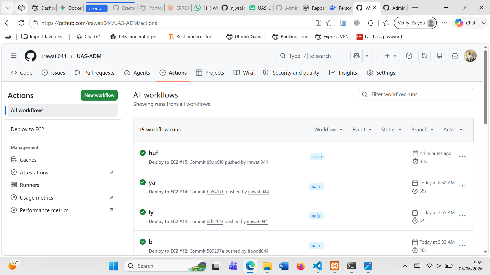

5. Tampilan web dinamis
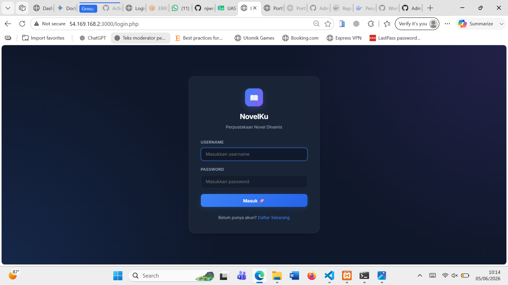

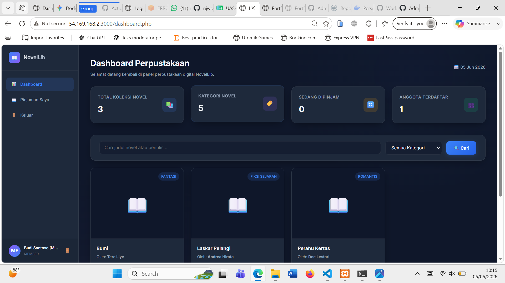

6.Tampilan web statis
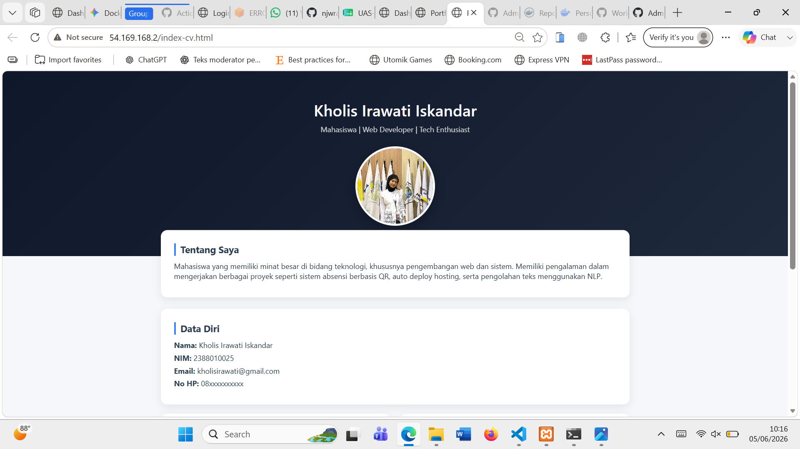